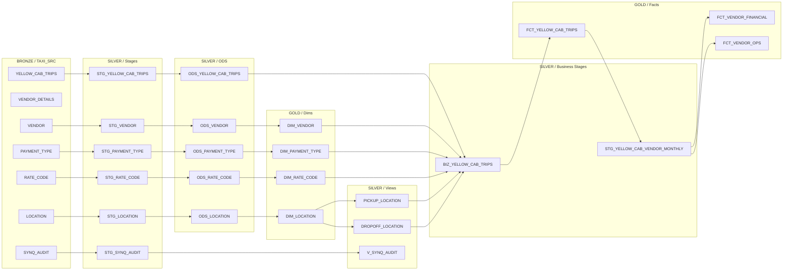

# NY Taxi DQ Demo — Pipeline Modelling Plan

Build `nodes/` from scratch to match the stable env-18 structure, with an ODS layer and
incremental loading added per the updated standards.

**VENDOR_DETAILS is deliberately excluded** from everything beyond the source node. It
exists in env 18 because Scott builds it live during demos — the pre-built pipeline
intentionally stops at the BRONZE source so `STG_VENDOR_DETAILS`, `ODS_VENDOR_DETAILS`,
`DIM_VENDOR_DETAILS` and `V_VENDOR_DETAILS` can be added in front of prospects.

## Entities in scope (from env 18, minus VENDOR_DETAILS pipeline)

| Entity | Source | Stage | ODS | Dim | Fact |
|---|---|---|---|---|---|
| VENDOR | yes | yes | yes | yes | — |
| VENDOR_DETAILS | **source only** | — | — | — | — |
| LOCATION | yes | yes | yes | yes | — |
| PAYMENT_TYPE | yes | yes | yes | yes | — |
| RATE_CODE | yes | yes | yes | yes | — |
| YELLOW_CAB_TRIPS | yes | yes | yes | — | yes |
| SYNQ_AUDIT | yes | yes (+ view) | — | — | — |

## Pipeline structure



`VENDOR_DETAILS` sits as an orphan source — no downstream nodes. That's intentional.

## Layer-by-layer specification

### Layer 1 — Stages (V2 SQL Stage, `@nodeType("6")`, `.sql`)

All stages read from `BRONZE` (mapped to `TAXI_SRC`) and truncate-and-reload. Reference
stages must dedupe the append-only source to latest-version-per-key.

| Node | Source | Dedup | Extra columns |
|---|---|---|---|
| `STG_VENDOR` | `BRONZE.VENDOR` | `QUALIFY ROW_NUMBER() OVER (PARTITION BY VENDOR_ID ORDER BY UPDATED_AT DESC) = 1` | `LICENSE_ISSUED_DATE`, `UPDATED_AT` passthrough |
| `STG_LOCATION` | `BRONZE.LOCATION` | same on `LOCATION_ID` | `ZONE_EFFECTIVE_DATE`, `UPDATED_AT` passthrough |
| `STG_PAYMENT_TYPE` | `BRONZE.PAYMENT_TYPE` | same on `PAYMENT_TYPE_ID` | `UPDATED_AT` passthrough |
| `STG_RATE_CODE` | `BRONZE.RATE_CODE` | same on `RATE_CODE_ID` | `TARIFF_EFFECTIVE_DATE`, `UPDATED_AT` passthrough |
| `STG_YELLOW_CAB_TRIPS` | `BRONZE.YELLOW_CAB_TRIPS` | no dedup (TRIP_ID unique) | `TRIP_DURATION_MINUTES`, `TRIP_AVG_SPEED`, `PICKUP_TIME_OF_DAY`, `TOTAL_COMPONENT_SUM` (for the business-rule test), `LOAD_DATE`, `LAST_MODIFIED_TS` passthrough |

`TOTAL_COMPONENT_SUM = COALESCE(FARE_AMOUNT,0) + COALESCE(EXTRA,0) + COALESCE(MTA_TAX,0)
+ COALESCE(TIP_AMOUNT,0) + COALESCE(TOLLS_AMOUNT,0) + COALESCE(IMPROVEMENT_SURCHARGE,0)
+ COALESCE(CONGESTION_SURCHARGE,0) + COALESCE(AIRPORT_FEE,0) + COALESCE(CBD_CONGESTION_FEE,0)`.

`STG_SYNQ_AUDIT` — unchanged from env 18, passthrough of `SYNQ_AUDIT` source.

### Layer 2 — ODS (V2 Persistent Stage, `@nodeType("9")`, `.sql`, SCD2)

Each ODS reads from its stage, MERGEs on the business key. System columns auto-added by the
node type.

| Node | Source | Business key | `@isChangeTracking` columns |
|---|---|---|---|
| `ODS_VENDOR` | `STG_VENDOR` | `VENDOR_ID` | `VENDOR_NAME` |
| `ODS_LOCATION` | `STG_LOCATION` | `LOCATION_ID` | `BOROUGH`, `ZONE`, `SERVICE_ZONE` |
| `ODS_PAYMENT_TYPE` | `STG_PAYMENT_TYPE` | `PAYMENT_TYPE_ID` | `PAYMENT_TYPE` |
| `ODS_RATE_CODE` | `STG_RATE_CODE` | `RATE_CODE_ID` | `RATE_CODE` |
| `ODS_YELLOW_CAB_TRIPS` | `STG_YELLOW_CAB_TRIPS` | `TRIP_ID` | all trip columns |

If `@isChangeTracking` errors (known template bug with ambiguous column names), fall back
to Type 1 by removing the annotation — the ODS still accumulates, just without SCD2
versioning on column drift.

### Layer 3 — Dimensions (V1, `.yml`)

Same dim structure as env 18, but re-sourced from ODS instead of stages. Each dim's join
filters to `SYSTEM_CURRENT_FLAG = 'Y'` on the ODS source.

| Node | Source | Business key | Change tracking |
|---|---|---|---|
| `DIM_VENDOR` | `ODS_VENDOR` | `VENDOR_ID` | `VENDOR_NAME` |
| `DIM_LOCATION` | `ODS_LOCATION` | `LOCATION_ID` | — (standard SCD) |
| `DIM_PAYMENT_TYPE` | `ODS_PAYMENT_TYPE` | `PAYMENT_TYPE_ID` | — |
| `DIM_RATE_CODE` | `ODS_RATE_CODE` | `RATE_CODE_ID` | — |

### Layer 4 — Location views (View, `.yml`)

`PICKUP_LOCATION` and `DROPOFF_LOCATION` — passthrough of `DIM_LOCATION`, surrogate key
aliased to `DIM_PICKUP_LOCATION_KEY` / `DIM_DROPOFF_LOCATION_KEY`. Unchanged from env 18.

### Layer 5 — Business stages

**`BIZ_YELLOW_CAB_TRIPS`** (V2 SQL Stage, `@nodeType("6")`) — the deliberately buggy node.

Sources: `ODS_YELLOW_CAB_TRIPS` joined to `DIM_VENDOR`, `DIM_PAYMENT_TYPE`, `DIM_RATE_CODE`,
`PICKUP_LOCATION`, `DROPOFF_LOCATION`.

Adds: dimension surrogate keys, descriptive attributes (`VENDOR_NAME`, `PAYMENT_TYPE`,
`RATE_CODE`, `PU_BOROUGH`, `DO_BOROUGH`).

**The bug:**

```sql
WHERE ODS_YELLOW_CAB_TRIPS.SYSTEM_CURRENT_FLAG = 'Y'
  AND TOTAL_AMOUNT > 0
  -- Exclude non-credit-card outer-borough trips (test data cleanup)
  AND NOT (
      PAYMENT_TYPE_ID IN (2, 3, 4)
      AND PU_BOROUGH <> 'Manhattan'
      AND DAYOFWEEKISO(CURRENT_DATE()) IN (2, 4)
  )
```

On Tue/Thu: drops all non-credit-card trips picked up outside Manhattan — ~22% of volume.
Other days: the `DAYOFWEEKISO` guard is false, so nothing extra is excluded. Source-layer
monitors stay green; `BIZ_YELLOW_CAB_TRIPS` and `FCT_YELLOW_CAB_TRIPS` monitors fire.

**`STG_YELLOW_CAB_VENDOR_MONTHLY`** — grain: vendor + year + month, aggregated from
`FCT_YELLOW_CAB_TRIPS`. Same columns as env 18.

### Layer 6 — Facts (V1, `.yml`)

| Node | Source | Business key | Incremental |
|---|---|---|---|
| `FCT_YELLOW_CAB_TRIPS` | `BIZ_YELLOW_CAB_TRIPS` | `TRIP_ID` | `preSQL` DELETE + SELECT filter on `PICKUP_DATETIME` date |
| `FCT_YELLOW_CAB_VENDOR_FINANCIAL` | `STG_YELLOW_CAB_VENDOR_MONTHLY` | `VENDOR_ID + YEAR + MONTH` | — |
| `FCT_YELLOW_CAB_VENDOR_OPS` | `STG_YELLOW_CAB_VENDOR_MONTHLY` | `VENDOR_ID + YEAR + MONTH` | — |

### Layer 7 — Synq audit (unchanged)

`STG_SYNQ_AUDIT`, `V_SYNQ_AUDIT` — carried forward as-is.

## Location mapping

| Location | workspace.yml (now) | workspace.yml (new) |
|---|---|---|
| `BRONZE` | `SWALKER_DB_DEV.TAXI_SRC` | unchanged |
| `SILVER` | `SWALKER_DB_DEV.SILVER` | `SWALKER_DB_DEV.TAXI_SILVER` |
| `GOLD` | `SWALKER_DB_DEV.GOLD` | `SWALKER_DB_DEV.TAXI_GOLD` |
| `SYNQ_AUDIT` | `NY_TAXI.SYNQ` | unchanged |

Same changes in `environments/Production-18.yml`.

## Build order

1. Remap SILVER/GOLD, create schemas
2. Register sources (`coa sources add` for TAXI_SRC tables)
3. Reference stages: `STG_VENDOR`, `STG_LOCATION`, `STG_PAYMENT_TYPE`, `STG_RATE_CODE`
4. Trip stage: `STG_YELLOW_CAB_TRIPS`
5. Reference ODS: `ODS_VENDOR`, `ODS_LOCATION`, `ODS_PAYMENT_TYPE`, `ODS_RATE_CODE`
6. Trip ODS: `ODS_YELLOW_CAB_TRIPS`
7. Dims: `DIM_VENDOR`, `DIM_LOCATION`, `DIM_PAYMENT_TYPE`, `DIM_RATE_CODE`
8. Location views: `PICKUP_LOCATION`, `DROPOFF_LOCATION`
9. `BIZ_YELLOW_CAB_TRIPS` (with the bug)
10. `FCT_YELLOW_CAB_TRIPS`
11. `STG_YELLOW_CAB_VENDOR_MONTHLY`
12. `FCT_YELLOW_CAB_VENDOR_FINANCIAL`, `FCT_YELLOW_CAB_VENDOR_OPS`
13. `STG_SYNQ_AUDIT`, `V_SYNQ_AUDIT`
14. `VENDOR_DETAILS` source only
15. Verify volume bug: compare BIZ/FCT row counts on a Tue load vs a Wed load

## Node count: 24 nodes

- 7 sources (incl. VENDOR_DETAILS as orphan)
- 6 stages + 1 synq stage = 7
- 5 ODS
- 4 dims
- 3 views (2 location + 1 synq)
- 1 business stage (BIZ) + 1 monthly rollup
- 3 facts

## Critical files

- [AGENTS.md](AGENTS.md) — standards (ODS, incremental, modularity rules)
- [workspace.yml](workspace.yml) — SILVER/GOLD remapping
- [environments/Production-18.yml](environments/Production-18.yml) — same remapping
- [snowflake_objects.sql](snowflake_objects.sql) — source DDL / loader proc
- [.claude/demo-plan.md](.claude/demo-plan.md) — needs updating after build to reflect new structure
